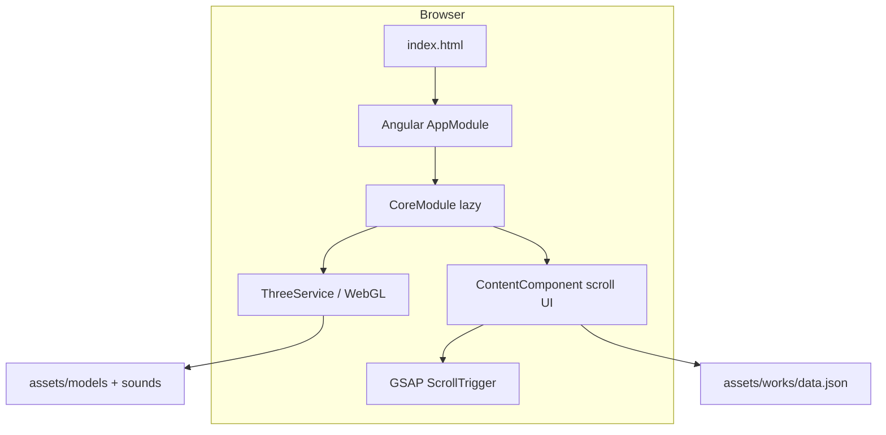

# Logartis.info — Site Reconstruction Report

**Source:** https://logartis.info/  
**Build date (from ngsw.json):** 2022-02-02  
**Local mirror location:** `logartis-reconstruction/`

---

## 1. Framework & Build System Assessment

| Item | Finding |
|------|---------|
| **Framework** | **Angular** (Ivy compiler — `fXoL` decorators in bundle) |
| **Angular version (estimated)** | **11.x – 12.x** (string-based lazy loading `#CoreModule`, build from Feb 2022) |
| **Build system** | **Angular CLI** → **Webpack** (custom webpack config likely) |
| **Output format** | Production build with content-hashed filenames |
| **PWA** | Yes — `@angular/service-worker`, `ngsw-worker.js`, `ngsw.json`, `manifest.webmanifest` |
| **UI library** | Angular Material (`@angular/material/*`) |
| **3D engine** | Three.js + postprocessing + custom shader/spawnable managers |
| **Animation** | GSAP (ScrollTrigger, ScrollToPlugin, TweenMax) |
| **Fonts** | Google Fonts: Josefin Sans, Lato, Material Icons (loaded externally) |

### JavaScript bundles

| File | Purpose |
|------|---------|
| `runtime.*.js` | Webpack runtime / module loader |
| `polyfills.*.js` | Modern browser polyfills (ES2015+) |
| `polyfills-es5.*.js` | Legacy ES5 polyfills (`nomodule`) |
| `main.*.js` | Application code (~2.3 MB) |
| `ngsw-worker.js` | Angular service worker |
| `safety-worker.js` / `worker-basic.min.js` | SW fallbacks |

### CSS bundles

| File | Notes |
|------|-------|
| `styles.8c9e672140f150fba930.css` | Active stylesheet (referenced in index.html) |
| `styles.179b37dcf67ef2be5c53.css` | Previous build artifact (still in ngsw cache list) |

### Source maps

**Present and downloadable:**

- `main.be139ff41f386a5b9c64.js.map` — 764 source entries, **includes embedded `sourcesContent`**
- `runtime.d4905fc349c3942af5be.js.map`
- `styles.8c9e672140f150fba930.css.map`

This enabled recovery of **95 application source files** under `recovered-source/src/`.

---

## 2. Asset Structure

```
logartis-reconstruction/
├── index.html                    # Angular shell (<app-root>)
├── main.*.js / polyfills.*.js    # Bundled application
├── styles.*.css                  # Global styles
├── manifest.webmanifest          # PWA manifest
├── ngsw.json / ngsw-worker.js    # Service worker cache manifest
├── assets/
│   ├── icon/                     # Favicons & apple-touch icons
│   ├── icons/                    # PWA icons (72–512px)
│   ├── models/                   # 3D assets (FBX, OBJ, GLTF, textures)
│   ├── sounds/                   # Ambient audio (mp3)
│   ├── works/
│   │   ├── data.json             # Portfolio project metadata
│   │   ├── illustration/         # Illustration project images (responsive sizes)
│   │   └── development/          # Dev project images
│   ├── cloud.png, lensflare*.png # Three.js textures
│   ├── me.jpg, mano.jpg          # Profile photos
│   └── thumbnail.jpg             # OG image
├── recovered-source/src/         # Recovered TypeScript/HTML from source map
└── scripts/                      # Local dev tooling
```

**Total downloaded:** 735 URLs from `ngsw.json` — **0 failures**, ~227 MB.

---

## 3. Dependency Analysis

### Core framework

- `@angular/core`, `@angular/common`, `@angular/router`, `@angular/forms`
- `@angular/platform-browser`, `@angular/platform-browser/animations`
- `@angular/material` (button, dialog, icon, input, tooltip, grid-list, progress-spinner)
- `@angular/cdk` (portal, layout, coercion)
- `@angular/service-worker`
- `rxjs`, `zone.js`, `tslib`, `hammerjs`

### 3D / graphics

- `three` (Three.js r13x — REVISION 136 in bundle)
- `postprocessing` (EffectComposer)
- `dat.gui` (debug GUI, likely dev-only paths)
- Custom managers: sky, lensflare, spawner, population, audio, animation, POI, pass, control

### Animation / UX

- `gsap` (+ ScrollTrigger, ScrollToPlugin, TweenMax/Expo)
- `normalize-wheel`
- Embedded `nipplejs` (virtual joystick for mobile fly controls)

### Third-party Angular libraries

- `ng-recaptcha` — contact form CAPTCHA
- `ngx-google-analytics` — GA4 (`G-7WH50KCDPS`)
- `ngx-device-detector` — device/browser detection (local monorepo path in source map)

### Other

- `lodash-es`, `@babel/runtime`, `regenerator-runtime`
- Google Fonts (CDN, not bundled)
- Google Tag Manager (external)

---

## 4. Component Hierarchy (Recovered)

```
AppComponent
├── LoaderComponent
├── ContactComponent (MatDialog)
└── CoreModule (lazy-loaded)
    └── MainComponent
        ├── ThreeComponent          # WebGL canvas / scene
        └── ContentComponent        # Scroll-driven UI overlay
            ├── Section2Component   # "Hey / This is me" intro
            ├── Section3Component   # Illustrations CTA
            ├── Section4Component   # Design & Dev CTA
            ├── Section5Component   # "Time to fly" freeflight
            ├── AboutComponent
            ├── ProgressComponent
            ├── ScrollIndicatorComponent
            ├── SlownoticeComponent
            ├── GridGalleryComponent
            │   ├── GridGalleryItemComponent
            │   ├── GridGalleryProjectComponent
            │   └── PreloaderComponent
            ├── ProjectViewComponent (dialog)
            ├── ManoComponent         # Cat section
            ├── FlycontrolsComponent
            │   └── MoodselectorComponent
            └── QaComponent

ThreeService orchestrates:
  LogAnimManager, LogAssetManager, LogAudioManager, LogControlManager,
  LogPassManager, LogSkyManager, LogPoiManager, LogPopulationManager,
  LogSpawnerManager, LogLensFlareManager, LogApiManager, AreaManager
```

---

## 5. Routing Implementation

Angular Router with lazy-loaded `CoreModule`:

```typescript
// app-routing.module.ts
{ path: "", loadChildren: "./core/core.module#CoreModule" }

// core-routing.module.ts
{ path: "**", component: MainComponent, children: [{ path: "", component: ContentComponent }] }
```

**Client-side URL segments** (handled in `ContentComponent` via scroll + router):

| Route | Purpose |
|-------|---------|
| `/` | Landing / scroll experience |
| `/about` | About section |
| `/illustration` | Illustration gallery |
| `/design-and-dev` | Development projects |
| Query params | Project detail overlays via `ProjectViewComponent` |

---

## 6. Missing / Incomplete Source Files

The production source map embedded most app code, but these referenced files were **not** in `sourcesContent`:

| Missing file | Referenced by |
|--------------|---------------|
| `log-builder-manager.ts` | `three.service.ts` |
| `colormanipulator.ts` | Multiple Three.js managers |
| `*.scss` style files | All components (only `.ts`/`.html` recovered) |
| `angular.json`, `package.json`, `tsconfig.json` | Not in production bundle |
| `environment.prod.ts` | Replaced at build time |

**Not missing:** All static assets (images, models, sounds, data.json) were downloaded successfully.

---

## 7. Running Locally

### Prerequisites

- Node.js 18+ (tested with v24)

### Quick start

```bash
cd "logartis-reconstruction"
npm install
npm start
```

Open **http://localhost:4200** in your browser.

> **Note:** Port 8080 is used by PostgreSQL/EnterpriseDB on this machine. The server defaults to **4200** (Angular CLI's default). Override with `PORT=3000 npm start`.

### Other scripts

```bash
npm run download-assets    # Re-download all assets from ngsw.json
npm run extract-sources    # Re-extract TypeScript from source map
```

### What works locally

- Full scroll-driven portfolio UI
- Three.js 3D scene with fly mode
- Illustration & development galleries (from `assets/works/data.json`)
- Contact dialog UI (reCAPTCHA/backend may fail without server endpoint)
- Google Analytics events (fire to production GA property)
- PWA service worker registers (may cache aggressively — use hard refresh or incognito for testing)

### External dependencies (require internet)

- Google Fonts (`fonts.googleapis.com`)
- Google Analytics / Tag Manager
- reCAPTCHA (contact form)

---

## 8. Reconstruction Approach

This reconstruction uses the **production build mirror** strategy:

1. Downloaded the complete deployed output including all hashed bundles and assets
2. Verified source maps exist and extracted original TypeScript/HTML into `recovered-source/`
3. Created a static file server with SPA fallback for local development

**Why not a full Angular dev rebuild?**

Recovering a compilable Angular project would require reconstructing `package.json`, `angular.json`, all SCSS files, and missing TypeScript modules. The production mirror runs identically to the live site without that effort.

To attempt a dev rebuild, use `recovered-source/` as a starting point and scaffold a new Angular 12 project matching the dependencies listed above.

---

## 9. Site Architecture (High Level)



---

## 10. Key Observations

- **Author:** Gergely Gizella — portfolio combining illustration and full-stack development
- **Signature feature:** Scroll-synced 3D forest scene with "freeflight" exploration mode
- **Build deployed:** February 2022, unchanged since (nginx `Last-Modified` matches)
- **Monorepo hints:** Source map paths reference `projects/ngx-device-detector` and `projects/ngx-google-analytics` as local libraries
- **Mobile:** Virtual joystick (nipplejs), device detection, responsive image srcsets in portfolio data
